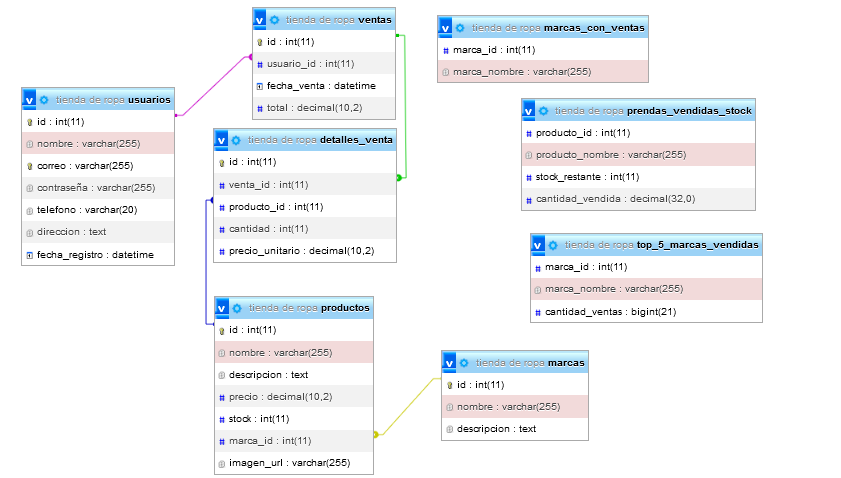

# 🛍️ API de Gestión para Tienda de Ropa

Este proyecto es un API de gestión de ventas para una tienda de ropa. Permite administrar productos, usuarios, marcas y ventas, además de generar reportes útiles sobre el inventario y las marcas más vendidas.

---

## 📄 Descripción del Proyecto

El sistema gestiona de manera eficiente el inventario y el flujo de ventas, utilizando una base de datos relacional que garantiza la integridad de los datos mediante claves foráneas. Está diseñado para ofrecer una experiencia fluida al usuario tanto en la inserción de datos como en la consulta de reportes.

---

## 🚀 Características Principales

- **Gestión de productos**: Registro de prendas, precios, cantidad y marcas.
- **Gestión de ventas**: Registro de cada venta y actualización automática del stock.
- **Control de usuarios**: Almacena datos de clientes para asociarlos con sus compras.
- **Reportes analíticos**: Muestra estadísticas como marcas más vendidas y stock restante.

---

## 📊 Diagrama 



## 🔗 Endpoints de la API

### 🔍 GET
Obtener usuario por ID: http://localhost/proyectoPlataformas/public/index.php/usuarios?id=...(3 para cuestiones de ejemplo)
Al enviar el parámetro con el id 3, se retorna el nombre el usuario registrado en base de datos.
- **Usuarios**
  - Obtener por ID: `/usuarios?id=3`
    ```json
    { "Resultado": { "nombre": "Luis Rodríguez" } }
    ```
Obtener todos los usuarios: http://localhost/proyectoPlataformas/public/index.php/usuarios
Se envía una solicitud de tipo get al endpoint y se obtiene una respuesta como esta:
- Obtener todos: `/usuarios`
    ```json
    {
      "Resultado": [
        {
          "id": 1,
          "nombre": "Juan Pérez",
          "correo": "juanperez@example.com",
          "contraseña": "password123",
          "telefono": "555-1234",
          "direccion": "Calle Falsa 123",
          "fecha_registro": "2024-01-01 10:00:00"
        }
      ]
    }
    ```

Obtener ventas por ID: http://localhost/proyectoPlataformas/public/index.php/ventas?id=...
Al hacer la solicitud con el envío del parámetro id asociado a ventas, se obtiene la identificación de la venta junto con el id del usuario que la realizó
{
    "Resultado": {
        "id": 3,
        "usuario_id": 3
    }
}


Obtener todas las ventas: http://localhost/proyectoPlataformas/public/index.php/ventas
Al hacer la solicitud de todas las ventas sin enviar un parámetro, se obtienen una respuesta como la siguiente, con todas las ventas registradas, con información adicional de la fecha y el total pagado/por pagar:

- **Ventas**
  - Por ID: `/ventas?id=3`
  - Todas: `/ventas`

Obtener productos por ID: http://localhost/proyectoPlataformas/public/index.php/productos?id=4
Tras solicitar la información correspondiente al id #4, se retorna la información del producto con esa identificación, en este caso su nombre y el precio del producto.
- **Productos**
  - Por ID: `/productos?id=4`
  - Todos: `/productos`

Obtener marcas por ID: http://localhost/proyectoPlataformas/public/index.php/marcas?id=5
Tras enviar el parámetro de id, se obtiene la información correspondiente al identificador, en este caso; su id y su nombre.
{
    "Resultado": {
        "id": 5,
        "nombre": "Deportes Activos"
    }
}

http://localhost/proyectoPlataformas/public/index.php/marcas
- **Marcas**
  - Por ID: `/marcas?id=5`
  - Todas: `/marcas`

Obtener detalles de ventas por ID: http://localhost/proyectoPlataformas/public/index.php/detalles?id=5

- **Detalles de ventas**
  - Por ID: `/detalles?id=5`
  - Todos: `/detalles`


- **Reportes**
  - Top 5 marcas: `/topMarcas`
  - Marcas con ventas: `/marcasVentas`
  - Prendas en stock: `/prendasStock`

Al ser vistas, estas no pueden modificarse
---

### ➕ POST

Insertar nuevo usuario: http://localhost/proyectoPlataformas/public/index.php/usuarios
Al apuntar a este endpoint, se debe proporcionar información para insertar un nuevo campo, en este caso, a modo explicativo, se hará a modo de objeto JSON con fotos de su inserción exitosa y respuesta del servidor.
- **Insertar nuevo usuario**
  - Endpoint: `/usuarios`
  - JSON de ejemplo:
    ```json
    {
      "nombre": "Juan Pérez",
      "correo": "juan.perez@example.com",
      "contraseña": "contraseña123",
      "telefono": "1234567890",
      "direccion": "Calle Falsa 123",
      "fecha_registro": "2024-12-18 12:00:00"
    }
    ```
 Respuesta del servidor
 Insert añadido a la base de datos

    - **Insertar nuevo producto**
  - Endpoint: `/productos`
  - JSON de ejemplo:
    ```json
    {
    "nombre": "Producto A",
    "descripcion": "Descripción del Producto A",
    "precio": 50.00,
    "stock": 100,
    "marca_id": 1,
    "imagen_url": "https://example.com/producto_a.jpg"
    }
    ```
     respuesta del servidor
     prueba de inserción

    - **Insertar venta**
  - Endpoint: `/ventas`
  - JSON de ejemplo:
    ```json
    {
        "usuario_id": 1,
    "fecha_venta": "2024-12-18 12:30:00",
    "total": 100.00
    }
    ```
   respuesta del servidor
   pruebas de inserción

    - **Insertar marca**
  - Endpoint: `/marcas`
  - JSON de ejemplo:
    ```json
    {
    "nombre": "Marca X",
    "descripcion": "Descripción de Marca X"
    }
    ```
   respuesta del servidor
   prueba de inserción

Insertar nuevo detalle de venta: http://localhost/proyectoPlataformas/public/index.php/detalles
Al apuntar a este endpoint, se debe proporcionar información para insertar un nuevo campo, en este caso, a modo explicativo, se hará a modo de objeto JSON con fotos de su inserción exitosa y respuesta del servidor.

    - **Insertar detalles**
  - Endpoint: `/detalles`
  - JSON de ejemplo:
    ```json
    {
    "venta_id": 1,
    "producto_id": 1,
    "cantidad": 2,
    "precio_unitario": 15.50
    }
    ```
   respuesta del servidor 
   prueba de inserción

### ❌ DELETE

- **Eliminar usuario**: `/usuarios?id=2`
respuesta del servidor: 

- **Eliminar producto**: `/productos?id=4`
respuesta del servidor: 


- **Eliminar marca**: `/marcas?id=2`
respuesta del servidor: 


### ✏️ PUT

- **Actualizar usuario**
  - Endpoint: `/usuarios?id=2`
  - JSON de ejemplo:
    ```json
    {
      "nombre": "Juan Pérez",
      "correo": "juan.perez@eeeexample.com",
      "contraseña": "contraseña123",
      "telefono": "0987654321",
      "direccion": "Nueva dirección 456",
      "fecha_registro": "2024-12-18 12:00:00"
    }
    ```
  respuesta del servidor: 

- **Actualizar producto**
  - Endpoint: `/productos?id=2`
  - JSON de ejemplo:
    ```json
    {
    "nombre": "Producto A",
    "descripcion": "Producto A con mejoras",
    "precio": 55.00,
    "stock": 90,
    "marca_id": 1,
    "imagen_url": "https://example.com/producto_a.jpg"
    }
    ```


respuesta del servidor: 

  - **Actualizar ventas**
  - Endpoint: `/ventas?id=2`
  - JSON de ejemplo:
    ```json
    {
    "usuario_id": 1,
    "fecha_venta": "2024-12-18 12:30:00",
    "total": 110.00
    }
    ```

respuesta del servidor: 

    - **Actualizar marcas**
  - Endpoint: `/marcas?id=2`
  - JSON de ejemplo:
    ```json
    {
    "nombre": "Marca X",
    "descripcion": "Descripción actualizada de Marca X"
    }
    ```
respuesta del servidor: 
      - **Actualizar detalles**
  - Endpoint: `/detalles?id=2`
  - JSON de ejemplo:
    ```json
    {
    "venta_id": 1,
    "producto_id": 1,
    "cantidad": 3,
    "precio_unitario": 16.00
    }
    ```

respuesta del servidor: 

